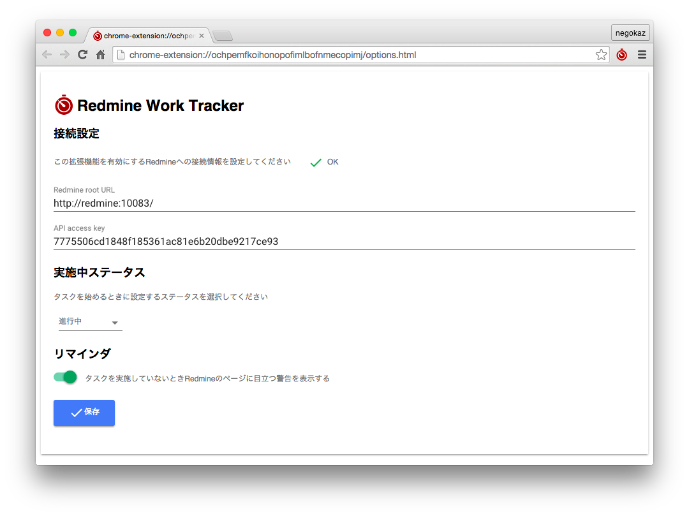
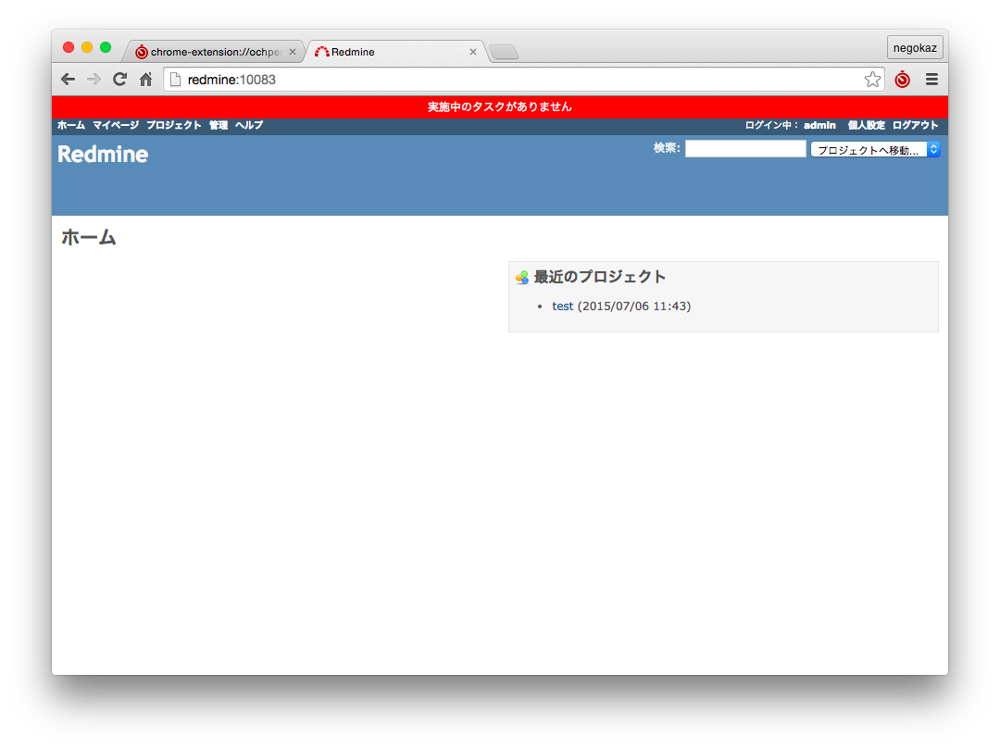
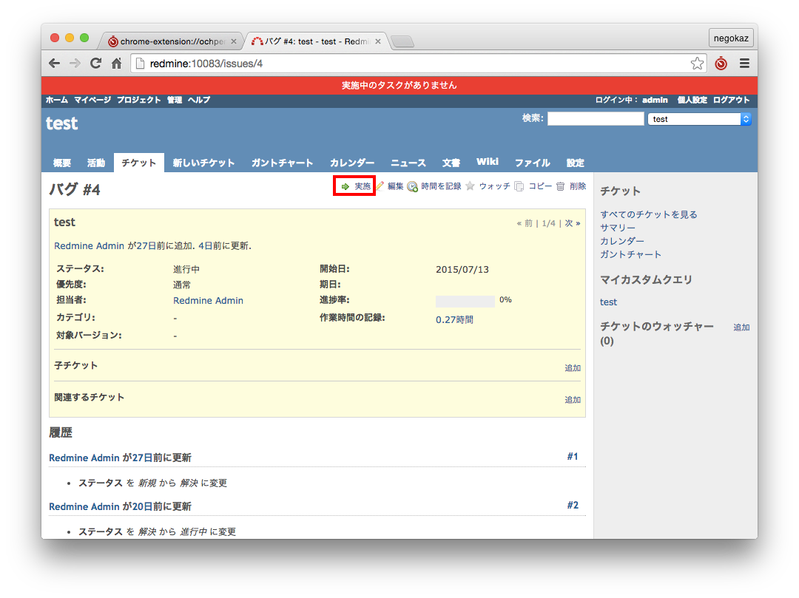
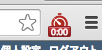
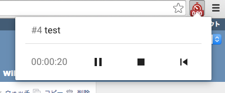
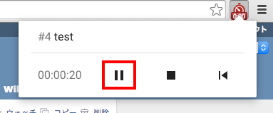
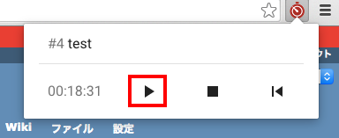
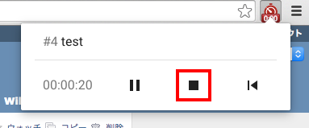
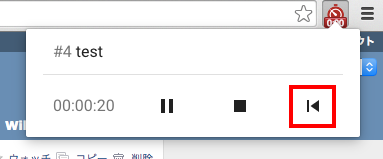
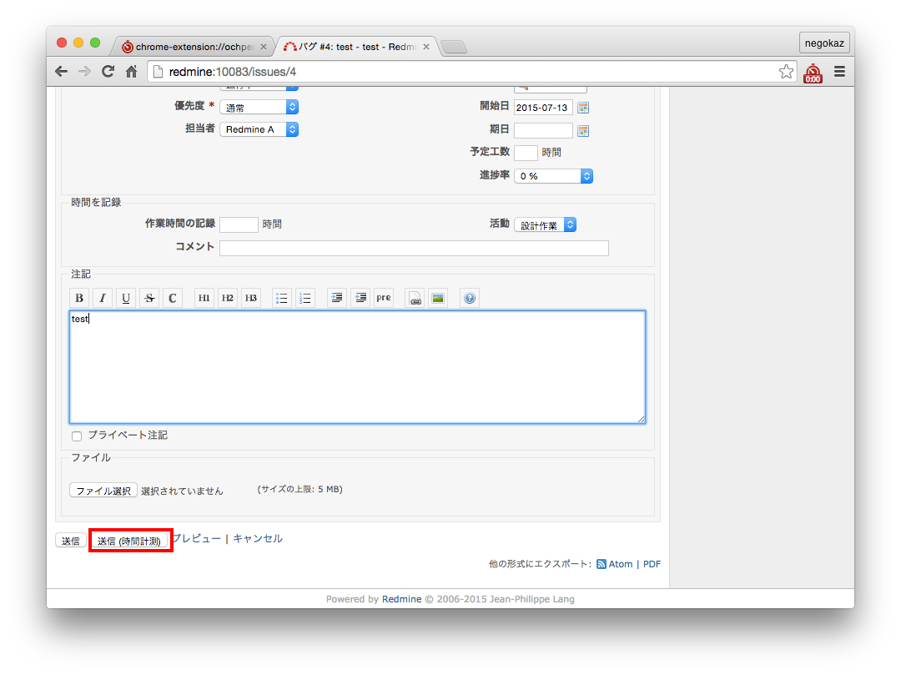

#  Redmine Work Tracker

Redmine Work Tracker は Redmine で簡単に精度の高い作業時間の記録ができるようになる Chrome の拡張機能です

## 動作確認できている環境

本拡張機能は下記の環境でテストされています

* Redmine 3.0.3.stable
* Chrome 44.0.2403.125 (64-bit)

## 制約

Redmine の時間トラッキングでは、作業時間にいくつかの補足情報を設定できますが、この拡張機能ではそれらを設定できません。

* 作業分類は選択できません
    * 作業時間はデフォルトの作業分類で記録されます
* 作業時間に対するコメントは設定できません
    * コメントは空文字で記録されます

## Redmine側の準備

Redmine Work Tracker を利用する前に Redmine でいくつか設定が必要です

* Redmineの時間トラッキングを有効にする
* デフォルトの作業分類を設定する
* REST API を有効にする

## インストール

[Chrome ウェブストア](https://chrome.google.com/webstore/detail/redmine-work-tracker/ochpemfkoihonopofimlbofnmecopimj)からインストールしてください

## 設定方法

### Redmine の URL を設定

Redmine のトップページのURLを設定します。

### Redmine の API Key を設定

APIキーは下記から確認できます。
~~~
Redmine上部のメニューバー > 個人設定 > APIアクセスキー > 表示
~~~

### タスクの実施中に設定したいステータスを選択

実施ボタン※ からタスクを開始したときにチケットへ設定したいステータスを選択します。

※ 使い方 > タスクを始める の項を参照

### リマインダを設定 (オプション)

この設定を有効にすると作業時間のカウントがされていないときに Redmine のページ上部に赤いバーのリマインダが表示されるようになります。

## 使い方

### タスクを始める

タスクに着手する場合はチケットのメニューに表示される「実施」ボタンをクリックします。このとき、チケットの状態が下記のように変更されます。
* 担当者が自分になります
* ステータスがオプション画面で設定したステータスになります

タスクの実施中は拡張機能によって時間がカウントされ、アイコン上に経過時間(時分)が表示されます。

アイコンをクリックすると、ポップアップ画面が表示されます。ポップアップ画面には下記が表示されます。
* 実施中のチケット番号
* 実施中のチケット名(チケットへのリンク)
* 経過時間(時分秒)
* 操作ボタン

### 別のタスクを始める

別のチケットで「実施」ボタンをクリックします。
このとき、実施中だったタスクの作業時間は Redmine に記録され、新しく作業時間のカウントが始まります。

### タスクを一時中断する

アイコンをクリックすると、ポップアップが表示されます。
ポップアップ画面上の一時停止ボタンをクリックすると、作業時間のカウントが停止します。(作業時間は Redmine に記録されません)

### 一時中断したタスクを再開する

ポップアップ画面上の再生ボタンをクリックすると、作業時間のカウントが再開します。

### タスクを終了する

アイコンをクリックすると、ポップアップが表示されます。
ポップアップ画面上の停止ボタンをクリックすると、Redmineへ作業時間が記録され、カウントがリセットされます。

### 時間の記録を取り消す

アイコンをクリックすると、ポップアップが表示されます。
ポップアップ画面上のリセットボタンをクリックすると作業時間のカウントが停止し、時間が `00:00:00`に戻ります。Redmineに作業時間は記録されません。

### 任意のステータスでタスクを始める

チケットの編集画面で、チケットの変更を行い「送信(時間計測)」ボタンをクリックします。実施ボタンとは異なり、担当者やステータスは **変更されません** 。
